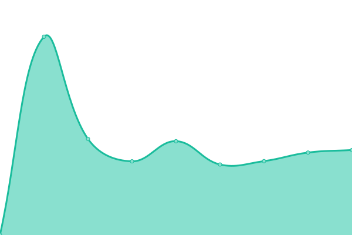

# [📈 Live Status](https://status.abakus.no): <!--live status--> **🟩 All systems operational**

This repository contains the open-source uptime monitor and status page for [Webkom](https://abakus.no), powered by [Upptime](https://github.com/upptime/upptime).

With [Upptime](https://upptime.js.org), you can get your own unlimited and free uptime monitor and status page, powered entirely by a GitHub repository. We use [Issues](https://github.com/webkom/uptime/issues) as incident reports, [Actions](https://github.com/webkom/uptime/actions) as uptime monitors, and [Pages](https://status.abakus.no) for the status page.

<!--start: status pages-->
<!-- This summary is generated by Upptime (https://github.com/upptime/upptime) -->
<!-- Do not edit this manually, your changes will be overwritten -->
<!-- prettier-ignore -->
| URL | Status | History | Response Time | Uptime |
| --- | ------ | ------- | ------------- | ------ |
|  [Abakus.no](https://abakus.no/healthz) | 🟩 Up | [abakus-no.yml](https://github.com/webkom/uptime/commits/HEAD/history/abakus-no.yml) | 

 420ms
     
 | 

<a href="https://status.abakus.no/history/abakus-no">99.34%</a>
    

|  [LEGO (abakus backend)](https://lego.abakus.no/health) | 🟩 Up | [lego-abakus-backend.yml](https://github.com/webkom/uptime/commits/HEAD/history/lego-abakus-backend.yml) | 

 1098ms
     
 | 

<a href="https://status.abakus.no/history/lego-abakus-backend">99.34%</a>
    

|  [Abakus wiki](https://wiki.abakus.no/status) | 🟩 Up | [abakus-wiki.yml](https://github.com/webkom/uptime/commits/HEAD/history/abakus-wiki.yml) | 

 528ms
     
 | 

<a href="https://status.abakus.no/history/abakus-wiki">100.00%</a>
    

<!--end: status pages-->

[**Visit our status website →**](https://status.abakus.no)

## 📄 License

- Powered by: [Upptime](https://github.com/upptime/upptime)
- Code: [MIT](./LICENSE) © [Webkom](https://abakus.no)
- Data in the `./history` directory: [Open Database License](https://opendatacommons.org/licenses/odbl/1-0/)
